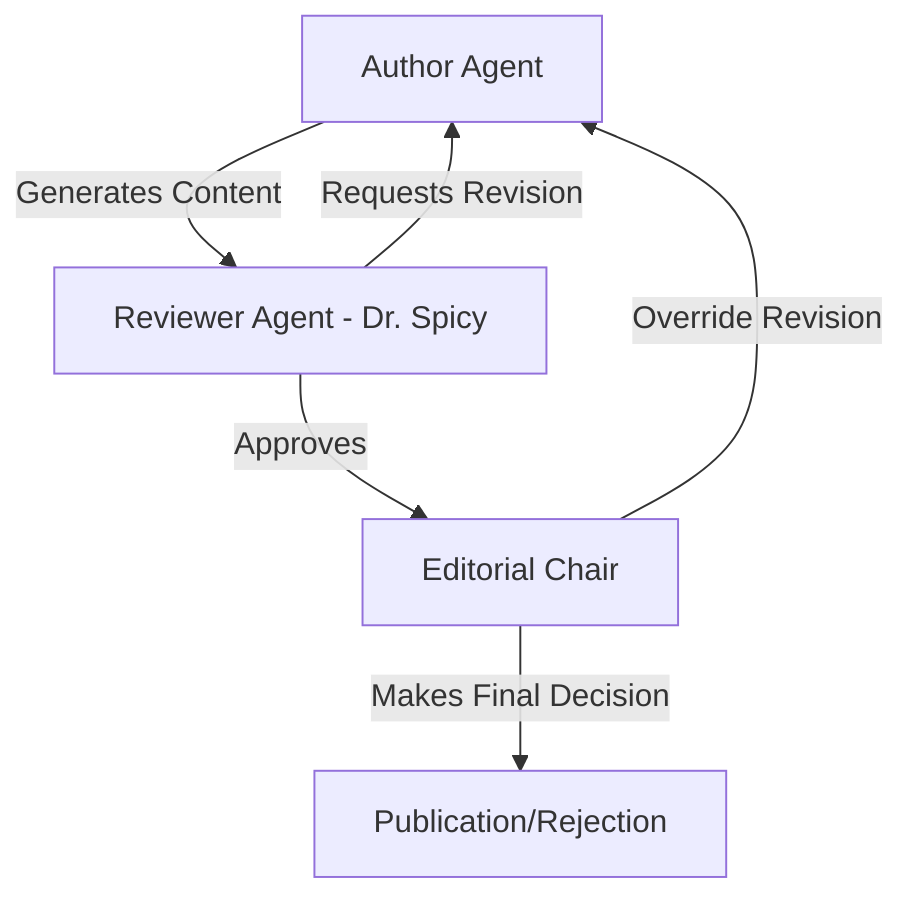

# 🥟 MomoPedia

**The world's first AI-powered encyclopedia dedicated exclusively to momos**

[](https://nabin.github.io/MomoPedia)
[](https://www.python.org/downloads/)
[](https://opensource.org/licenses/MIT)
[](https://github.com/langchain-ai/langgraph)

---

## 🌟 Overview

MomoPedia is a revolutionary AI-powered encyclopedia that celebrates the rich cultural heritage and diversity of momos - those beloved dumplings cherished across cultures. We combine cutting-edge AI technology with deep cultural respect to create comprehensive, authentic, and engaging content about momo varieties from around the world.

### ✨ Key Features

- **🤖 Multi-Agent AI System**: Sophisticated workflow with Author, Reviewer, and Editorial Chair agents
- **🌍 Cultural Authenticity**: AI trained to respect and accurately represent cultural traditions  
- **📚 Comprehensive Content**: Detailed articles covering history, preparation, regional variations
- **🔍 Quality Assurance**: Multi-stage review process ensuring accuracy and cultural sensitivity
- **📊 Advanced Monitoring**: Real-time performance metrics and quality assessment
- **🎨 Beautiful Design**: Professional branding with culturally sensitive visual identity
- **📱 Responsive Website**: Jekyll-powered GitHub Pages site with modern UX

## 🚀 Quick Start

### Prerequisites

- Python 3.11 or higher
- Git
- OpenRouter API key (or compatible LLM API)

### Installation

1. **Clone the repository**
   ```bash
   git clone https://github.com/nabin/MomoPedia.git
   cd MomoPedia
   ```

2. **Set up virtual environment**
   ```bash
   python -m venv venv
   source venv/bin/activate  # On Windows: venv\Scripts\activate
   ```

3. **Install dependencies**
   ```bash
   pip install -e .
   ```

4. **Configure environment variables**
   ```bash
   cp .env.example .env
   # Edit .env with your API keys
   ```

5. **Run the system**
   ```bash
   python main.py
   ```

## 🏗️ Architecture

### AI Agent Workflow



### System Components

- **Author Agent**: Researches and writes comprehensive momo articles
- **Reviewer Agent (Dr. Spicy)**: Critically reviews for accuracy and cultural authenticity  
- **Editorial Chair**: Makes final publication decisions with editorial oversight
- **Content Quality System**: Multi-dimensional scoring and validation
- **Monitoring System**: Performance tracking and error handling
- **Web Research Tools**: Integration with Tavily for authentic information gathering

## 📖 Documentation

### Core Documentation
- [Installation Guide](docs/installation.md) - Detailed setup instructions
- [Configuration Guide](docs/configuration.md) - System configuration options
- [AI Agent Guide](docs/ai-agents.md) - Understanding the AI workflow
- [API Documentation](docs/api.md) - REST API reference
- [Deployment Guide](docs/deployment.md) - Production deployment

### Development
- [Contributing Guide](CONTRIBUTING.md) - How to contribute to MomoPedia
- [Development Setup](docs/development.md) - Setting up dev environment
- [Testing Guide](docs/testing.md) - Running and writing tests
- [Architecture Overview](docs/architecture.md) - Technical architecture

### Content & Quality
- [Content Guidelines](docs/content-guidelines.md) - Writing standards
- [Quality Metrics](docs/quality-metrics.md) - Understanding quality scoring
- [Cultural Sensitivity](docs/cultural-sensitivity.md) - Our approach to cultural respect
- [Adding Regions](docs/adding-regions.md) - Expanding geographic coverage

## 🎯 Usage Examples

### Basic Article Generation

```python
from momopedia.main import run_workflow
from momopedia.state import MomoState

# Create initial state
initial_state = MomoState(
    topic="Traditional Nepali Momos: Cultural Heritage and Regional Variations",
    messages=[],
    iteration=0,
    next_step="author"
)

# Run the AI workflow
final_state = run_workflow(initial_state)

# Access the results
if final_state["chair_decision"] == "ACCEPTED":
    article = final_state["article"]
    print(f"Title: {article['title']}")
    print(f"Quality Score: {final_state['final_score']:.2f}")
```

### Configuration Customization

```python
from momopedia.config.settings import update_config

# Customize AI behavior
update_config(
    author={
        "research_depth": "comprehensive",
        "min_word_count": 800,
        "cultural_sensitivity_check": True
    },
    reviewer={
        "strictness_level": "high",
        "auto_approve_threshold": 0.85
    }
)
```

## 🌐 Live Demo

Visit our GitHub Pages site: **[MomoPedia.github.io](https://nabin.github.io/MomoPedia)**

The site features:
- Interactive article browser
- AI methodology explanation  
- Cultural region explorer
- Real-time content generation demos
- Complete API documentation

## 🤝 Contributing

We welcome contributions from developers, cultural experts, food enthusiasts, and momo lovers worldwide!

### Ways to Contribute

- **Code**: Enhance AI agents, add features, fix bugs
- **Content**: Review articles for cultural accuracy
- **Documentation**: Improve guides and examples
- **Testing**: Add test cases and quality assurance
- **Translations**: Help make content multilingual
- **Feedback**: Share suggestions and report issues

See our [Contributing Guide](CONTRIBUTING.md) for detailed instructions.

## 🔧 Development

### Local Development Setup

```bash
# Install development dependencies
pip install -e ".[dev]"

# Set up pre-commit hooks
pre-commit install

# Run tests
pytest

# Start development server (for API)
uvicorn momopedia.api:app --reload

# Build Jekyll site locally
cd docs && bundle install && bundle exec jekyll serve
```

### Project Structure

```
MomoPedia/
├── src/momopedia/          # Core AI system
│   ├── agents/             # AI agents (Author, Reviewer, Chair)
│   ├── config/             # Configuration management
│   ├── monitoring/         # System monitoring & metrics
│   ├── tools/              # Web research tools
│   └── utils/              # Utilities and quality control
├── docs/                   # Jekyll website & documentation
├── branding/               # Design system & brand assets
├── tests/                  # Test suite
└── reports/                # Generated reports & analytics
```

## 📊 Quality & Performance

### Content Quality Metrics

- **Cultural Authenticity**: Respectful representation of traditions
- **Factual Accuracy**: Verification against reliable sources
- **Writing Quality**: Clarity, engagement, and readability
- **Citation Quality**: Reliable sources and proper attribution
- **Completeness**: Comprehensive coverage of topics

### Performance Monitoring

- Real-time agent performance tracking
- Content generation speed optimization
- Quality score trends and analysis
- Error tracking and resolution
- User engagement analytics

## 🛡️ Production Deployment

### Docker Deployment

```bash
# Build container
docker build -t momopedia .

# Run with environment variables
docker run -e OPENROUTER_API_KEY=your_key momopedia
```

### Cloud Deployment

- **GitHub Pages**: Automatic Jekyll site deployment
- **Heroku**: Ready for container deployment
- **AWS/GCP**: Scalable cloud deployment options
- **API Gateway**: Production API endpoints

## 📦 Dependencies

### Core Dependencies
- **LangGraph**: Multi-agent workflow orchestration
- **LangChain**: AI agent framework and tools
- **Pydantic**: Data validation and settings
- **FastAPI**: Modern web API framework
- **Tavily**: Web research integration

### Quality & Monitoring
- **NLTK**: Natural language processing
- **Rich**: Beautiful terminal output
- **Pytest**: Comprehensive testing framework

## 🗺️ Roadmap

### Phase 1: Foundation ✅
- [x] Multi-agent AI system
- [x] Quality control & monitoring  
- [x] Jekyll website deployment
- [x] Comprehensive documentation

### Phase 2: Enhancement 🚧
- [ ] REST API development
- [ ] Advanced testing suite
- [ ] CI/CD pipeline setup
- [ ] Performance optimization

### Phase 3: Scale 📋
- [ ] Multilingual content generation
- [ ] Community contribution system
- [ ] Mobile app development
- [ ] Advanced analytics dashboard

### Phase 4: Innovation 🌟
- [ ] Video content generation
- [ ] Interactive recipe calculator
- [ ] AR/VR cultural experiences
- [ ] AI-powered recipe recommendations

## 🏆 Recognition

MomoPedia represents a groundbreaking approach to cultural documentation through AI:

- **Cultural Sensitivity**: Setting standards for respectful AI content generation
- **Technical Innovation**: Advanced multi-agent workflow architecture
- **Community Impact**: Preserving and sharing culinary cultural heritage
- **Open Source**: Transparent, collaborative development model

## 📄 License

This project is licensed under the MIT License - see the [LICENSE](LICENSE) file for details.

## 🙏 Acknowledgments

- **Cultural Consultants**: Food historians and cultural experts worldwide
- **Open Source Community**: LangChain, LangGraph, and AI framework contributors
- **Momo Communities**: Preservers of traditional recipes and techniques
- **Contributors**: Developers, researchers, and enthusiasts building MomoPedia

## 📞 Support & Contact

- **GitHub Issues**: [Report bugs or request features](https://github.com/nabin/MomoPedia/issues)
- **Discussions**: [Community forum](https://github.com/nabin/MomoPedia/discussions)  
- **Email**: hello@momopedia.org
- **Documentation**: [Complete guides and API docs](https://nabin.github.io/MomoPedia)

---

**Built with ❤️ and AI for momo lovers everywhere** 🥟✨

*MomoPedia - Where Tradition Meets Technology*