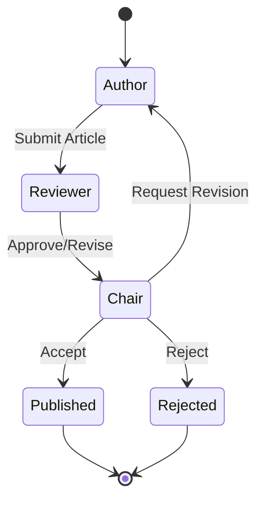

# 🤖 AI Agents Guide

**Understanding MomoPedia's Multi-Agent System**

---

## Overview

MomoPedia employs a sophisticated multi-agent AI system designed to generate high-quality, culturally sensitive content about momos. The system consists of three specialized agents working together in a collaborative workflow to ensure accuracy, authenticity, and editorial quality.

## Agent Architecture

### Workflow Process

1. **Author Agent** generates comprehensive content
2. **Reviewer Agent (Dr. Spicy)** evaluates and provides feedback
3. **Editorial Chair** makes final publication decisions



## Agent Specifications

### 🖋️ Author Agent (Enhanced)

**Role**: Primary content generator with deep knowledge of momo culture and cuisine.

#### Capabilities
- **Research Integration**: Uses Tavily web research for current information
- **Cultural Awareness**: Trained on cultural sensitivity and authenticity
- **Content Structure**: Creates well-organized, comprehensive articles
- **Source Citation**: Provides reliable references and attribution
- **Quality Metrics**: Self-assessment of content completeness

#### Configuration Options

```python
author_config = {
    "research_depth": "comprehensive",  # basic, standard, comprehensive
    "min_word_count": 800,
    "max_word_count": 2000,
    "include_historical_context": True,
    "cultural_sensitivity_check": True,
    "citation_requirements": "required"  # optional, preferred, required
}
```

#### Quality Metrics Tracked
- **Content Completeness** (0.0-1.0): Coverage of topic aspects
- **Research Quality** (0.0-1.0): Source reliability and depth
- **Cultural Accuracy** (0.0-1.0): Respectful representation
- **Writing Quality** (0.0-1.0): Clarity and engagement

#### Sample Output Structure
```javascript
{
    "title": "Traditional Nepali Momos: Cultural Heritage and Regional Variations",
    "content": "...",  // Main article content
    "sources": [...],  // Research citations
    "cultural_notes": "...",  // Cultural sensitivity notes
    "quality_metrics": {
        "completeness": 0.92,
        "research_quality": 0.88,
        "cultural_accuracy": 0.95,
        "writing_quality": 0.90
    }
}
```

### 🌶️ Reviewer Agent - Dr. Spicy (Enhanced)

**Role**: Expert critic ensuring quality, accuracy, and cultural authenticity.

#### Personality & Approach
- **Critical but Fair**: High standards with constructive feedback
- **Cultural Expert**: Deep knowledge of regional momo traditions
- **Quality Focused**: Emphasis on accuracy and authenticity
- **Educational**: Provides learning opportunities through feedback

#### Review Dimensions

1. **Cultural Authenticity** (Weight: 30%)
   - Accurate representation of traditions
   - Respectful language and context
   - Regional variation acknowledgment

2. **Factual Accuracy** (Weight: 25%)
   - Verifiable claims and statements
   - Proper historical context
   - Ingredient and preparation accuracy

3. **Writing Quality** (Weight: 20%)
   - Clarity and readability
   - Engaging narrative flow
   - Appropriate tone and style

4. **Completeness** (Weight: 15%)
   - Comprehensive topic coverage
   - Missing information identification
   - Balanced perspective

5. **Citation Quality** (Weight: 10%)
   - Reliable source verification
   - Proper attribution format
   - Source diversity and authority

#### Configuration Options

```python
reviewer_config = {
    "strictness_level": "high",  # low, medium, high
    "auto_approve_threshold": 0.85,
    "cultural_weight": 0.30,
    "min_score_requirement": 0.70,
    "feedback_detail": "comprehensive"  # brief, standard, comprehensive
}
```

#### Sample Review Output
```javascript
{
    "overall_score": 0.87,
    "dimension_scores": {
        "cultural_authenticity": 0.92,
        "factual_accuracy": 0.85,
        "writing_quality": 0.88,
        "completeness": 0.90,
        "citation_quality": 0.80
    },
    "feedback": "Excellent coverage of Nepali momo traditions...",
    "specific_issues": [...],
    "recommendations": [...],
    "decision": "APPROVED"
}
```

### 🎯 Editorial Chair Agent (Enhanced)

**Role**: Final decision maker with editorial oversight and conflict resolution.

#### Responsibilities
- **Final Publication Decisions**: Accept, reject, or request revisions
- **Conflict Resolution**: Handle disagreements between Author and Reviewer
- **Editorial Standards**: Maintain publication quality consistency
- **Strategic Guidance**: Long-term content strategy and direction

#### Decision Factors

1. **Quality Threshold**: Minimum acceptable standards
2. **Strategic Fit**: Alignment with MomoPedia mission
3. **Resource Allocation**: Cost-benefit of revisions
4. **Editorial Balance**: Maintaining diverse content portfolio

#### Configuration Options

```python
chair_config = {
    "min_acceptance_score": 0.75,
    "max_revisions": 3,
    "strategic_priorities": ["cultural_diversity", "accuracy", "engagement"],
    "override_threshold": 0.90,  # Can override reviewer rejection
    "editorial_style": "progressive"  # conservative, balanced, progressive
}
```

#### Decision Matrix

| Reviewer Score | Author Effort | Chair Decision |
|---------------|---------------|----------------|
| ≥ 0.85 | Any | AUTO-ACCEPT |
| 0.70-0.84 | High | ACCEPT |
| 0.70-0.84 | Low | REVISE |
| 0.50-0.69 | High | REVISE (Final) |
| 0.50-0.69 | Low | REJECT |
| < 0.50 | Any | REJECT |

## System Monitoring

### Performance Metrics

```python
# Agent performance tracking
{
    "author_metrics": {
        "articles_generated": 156,
        "average_quality": 0.84,
        "revision_rate": 0.23,
        "cultural_accuracy": 0.91
    },
    "reviewer_metrics": {
        "reviews_completed": 156,
        "approval_rate": 0.68,
        "average_review_score": 0.79,
        "feedback_helpfulness": 0.87
    },
    "chair_metrics": {
        "decisions_made": 156,
        "acceptance_rate": 0.72,
        "override_rate": 0.05,
        "consistency_score": 0.93
    }
}
```

### Quality Trends

- **Improvement Over Time**: Agents learn and improve through feedback
- **Consistency Monitoring**: Ensuring stable quality standards
- **Cultural Sensitivity**: Tracking respectful representation
- **User Satisfaction**: Measuring content utility and engagement

## Advanced Configuration

### Custom Agent Personalities

```python
# Create specialized reviewer for specific regions
tibetan_reviewer = EnhancedReviewerAgent(
    name="Dr. Tenzin",
    expertise=["Tibetan_momos", "high_altitude_cooking"],
    cultural_background="Tibetan",
    strictness_level="high",
    specialization_weight=0.4
)

# Regional author specialist
nepalese_author = EnhancedAuthorAgent(
    name="Chef Karma",
    specialization=["Nepali_cuisine", "traditional_recipes"],
    research_focus="cultural_authenticity",
    min_cultural_score=0.9
)
```

### Workflow Customization

```python
# Custom workflow for sensitive topics
cultural_workflow = {
    "pre_research": True,
    "cultural_expert_review": True,
    "community_feedback": True,
    "final_cultural_validation": True
}

# Fast-track for simple topics
simple_workflow = {
    "auto_approve_threshold": 0.80,
    "max_iterations": 2,
    "skip_minor_revisions": True
}
```

## Best Practices

### Content Guidelines

1. **Cultural Sensitivity**
   - Research authentic cultural practices
   - Use respectful language and terminology
   - Acknowledge source communities
   - Avoid cultural appropriation

2. **Quality Standards**
   - Verify all factual claims
   - Provide reliable sources
   - Maintain consistent writing style
   - Include comprehensive coverage

3. **Iterative Improvement**
   - Learn from reviewer feedback
   - Track quality metrics over time
   - Adjust based on performance data
   - Regular configuration updates

### Troubleshooting

#### Common Issues and Solutions

**Low Quality Scores**
- Check research depth and sources
- Verify cultural accuracy claims
- Improve writing clarity and flow
- Add missing topic coverage

**Reviewer-Author Conflicts**
- Review feedback specificity
- Check cultural consultant input
- Consider specialist reviewer assignment
- Escalate to Editorial Chair

**Performance Degradation**
- Monitor agent metrics regularly
- Update training data periodically
- Adjust configuration parameters
- Review system resource allocation

## Integration Examples

### Basic Workflow

```python
from momopedia.agents import EnhancedAuthorAgent, EnhancedReviewerAgent, EnhancedChairAgent
from momopedia.state import MomoState

# Initialize agents
author = EnhancedAuthorAgent()
reviewer = EnhancedReviewerAgent() 
chair = EnhancedChairAgent()

# Create workflow state
state = MomoState(
    topic="Bhutanese Red Rice Momos: Tradition Meets Innovation",
    next_step="author"
)

# Execute workflow
final_state = run_multi_agent_workflow(state, author, reviewer, chair)
```

### Custom Pipeline

```python
# Specialized pipeline for regional content
def create_regional_pipeline(region: str):
    author = EnhancedAuthorAgent(
        research_focus=f"{region}_cuisine",
        cultural_sensitivity_check=True
    )
    
    reviewer = get_regional_reviewer(region)
    
    chair = EnhancedChairAgent(
        min_acceptance_score=0.80,
        cultural_priority_weight=0.4
    )
    
    return AgentPipeline(author, reviewer, chair)

# Usage
tibetan_pipeline = create_regional_pipeline("Tibetan")
result = tibetan_pipeline.run("Traditional Tingmo: Tibetan Steamed Bread Momos")
```

---

**Next Steps**: Learn about [Configuration Management](configuration.md) or explore [Quality Metrics](quality-metrics.md).